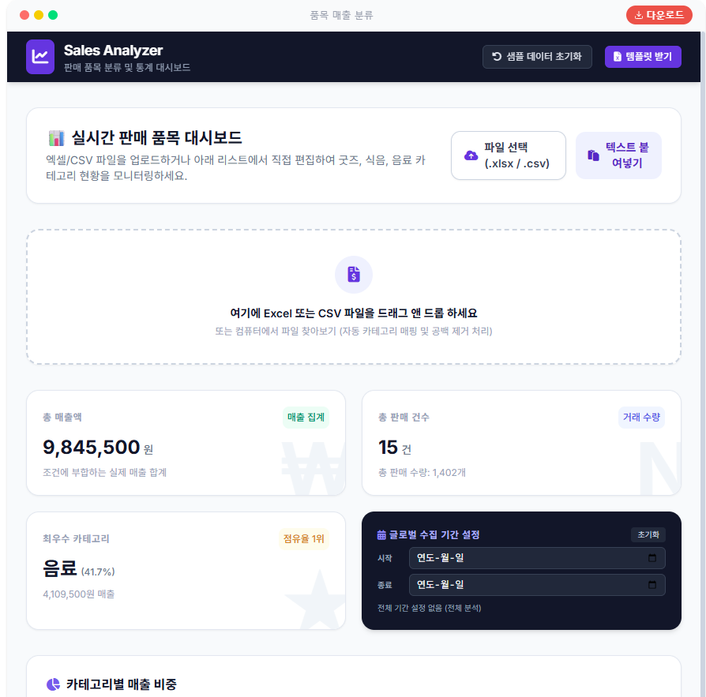
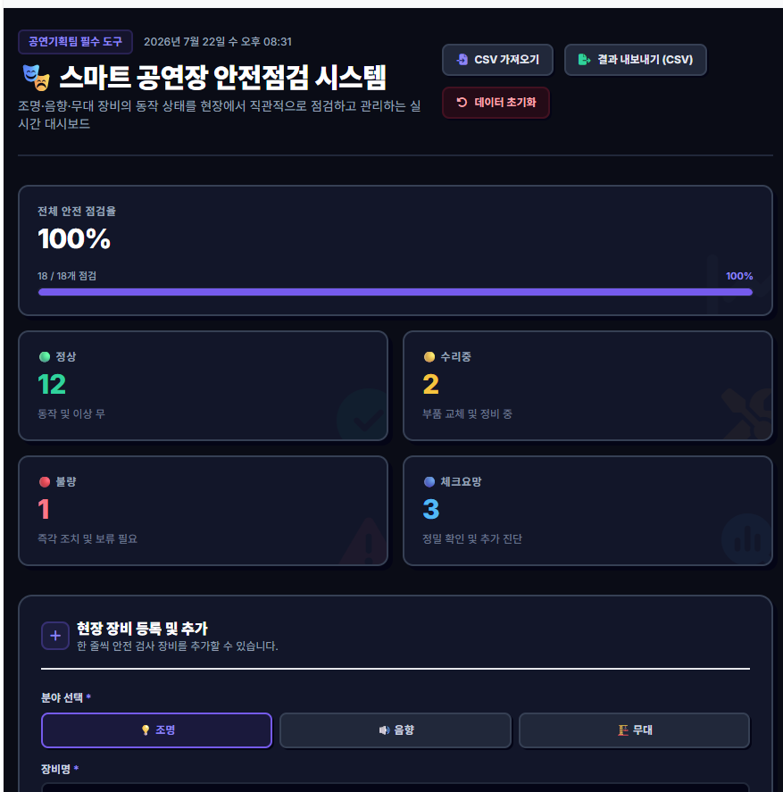

# [롯데월드] AX리더쉽 & 바이브코딩 교육 결과보고서

- 교육 기간: 2026.06.30 ~ 2026.07.06 (총 4회차, 회차별 1일 09:00~18:00)
- 담당 매니저: 송찬호
- Contact: chanho.song@teamsparta.co

---

## I. 교육과정 개요

| 항목 | 내용 |
|---|---|
| 과정명 | 롯데월드 AX리더쉽 & 바이브코딩 교육 |
| 교육 목적 | 리더급 임직원 대상 생성형 AI 활용 리터러시 강화 및 Gemini Canvas 기반 바이브코딩 실습을 통한 업무 자동화·데이터 대시보드 제작 역량 확보 |
| 교육 일정 | 1회차 2026.06.30 / 2회차 2026.07.01 / 3회차 2026.07.02 / 4회차 2026.07.06 (총 4회차) |
| 교육 시간 | 회차별 1일, 09:00~18:00 |
| 교육 대상 | 롯데월드 임직원 (전체 160명 규모, 회차별 편성) |
| 사용 도구 | Google Gemini Canvas (교육용 Gemini 계정 지급) |
| 교육 장소 | 롯데월드 웰빙센터 B1F Challenge 강의장 (서울 송파구 올림픽로 240) |
| 진행 인력 | 기술튜터 6인 로테이션(손준서·이경준·우지영·유상호·조효은·김은지), 멘토 이호인(전 회차 참여) |

### 학습 목표
1. 생성형 AI의 특성과 리스크를 이해하고 업무에 맞는 프롬프트를 구조화하여 설계할 수 있다.
2. 실습을 통해 데이터 정리·시각화·업무 자동화 아이디어를 도출하고 적용할 수 있다.
3. Gemini Canvas 기반 바이브코딩을 체험하여 대시보드 등 실제 결과물을 직접 제작할 수 있다.

### 세부 커리큘럼

| 회차 | 주요 내용 |
|---|---|
| 1~4회차 (06/30, 07/01, 07/02, 07/06) | 생성형 AI 개념·리스크 이해 및 구조화된 프롬프트 설계(AX리더쉽) + Gemini Canvas 기반 바이브코딩 실습, 업무 데이터 기반 대시보드(VOG 등) 제작 프로젝트(바이브코딩)를 하루 과정 안에 결합하여 4개 회차에 동일하게 운영 |

---

## II. 교육 결과물

교안·실습 자료 등 확정 링크가 조회되지 않아 별도 확인이 필요합니다. [확인 필요]

### 실습 결과물 예시 — AI 이미지 생성

| 카피바라 파티 스티커 | 롯데월드 부산 시즌 포스터 시안 | 그래픽 아트 시안 |
|---|---|---|
|  |  |  |

### 실습 결과물 예시 — 바이브코딩 대시보드

| Sales Analyzer (판매 품목 분류·통계 대시보드) | 스마트 공연장 안전점검 시스템 |
|---|---|
|  |  |

---

## III. 교육 만족도 조사 결과

- 응답 수: 143명 (테스트 응답 1건 제외, 4개 회차 합산 / 06.30: 31명, 07.01: 38명, 07.02: 30명, 07.06: 44명)
- 척도: 5점 척도 (1=매우 불만족 ~ 5=매우 만족)

### 정량 평가 (5점 척도, 전체)

| 항목 | 평균 | 100점 환산 |
|---|---|---|
| 전반적인 만족도 | 4.67 | 93.4 |
| 콘텐츠 깊이·난이도 적절성 | 4.53 | 90.6 |
| 강사 전문성·소통 | 4.66 | 93.3 |
| 부가자료(사례·실습) 도움 | 4.64 | 92.9 |
| 튜터 멘토링 도움 | 4.69 | 93.7 |
| 동료 추천 의향 | 4.69 | 93.7 |
| **종합 평균** | **4.65** | **92.9** |

※ "동료 추천 의향" 문항은 0~10점 NPS가 아닌 5점 척도로 조사되어 위 표에 함께 반영했습니다.

### 정성 평가

**가장 만족한 점 / 개선 요청 사항 (복수 선택)**

| 가장 만족한 점 | 응답 수 | 개선 요청 사항 | 응답 수 |
|---|---|---|---|
| 실습 위주의 학습 방식 | 100 | 교육 일정 및 진행 시간 | 27 |
| 실무 적용 가능성 | 85 | 실무 적용 가능성 | 20 |
| 강사의 전달력 및 커뮤니케이션 | 71 | 교육 자료 및 콘텐츠의 난이도 | 14 |
| 교육 자료 및 콘텐츠의 품질 | 62 | 개인 맞춤 피드백 부족 | 14 |
| 개인 맞춤 피드백 제공 | 39 | 실습 위주의 학습 방식 | 3 |
| 강사의 강의 속도 | 22 | 강사의 전달력 및 커뮤니케이션 | 2 |

**수강생 정성 피드백**

긍정 피드백
> "업무에 있어 너무나 유익한 내용으로 강의를 해주셔서 만족스럽습니다" — 조창희
>
> "내용에 조금 어려운 감이 있지만 100번 듣고 싶어요! 바이브코딩 너무 먼 이야기였는데 이거 들으니 당장 적용해 볼 수 있을 것 같아서 너무 좋았습니다." — 장연수

개선 요청
> "웹 생성 자체에 오랜 기다림이 필요하고, 업데이트 서브 자료에 대한 충분한 설명도 필요할 것 같아요. 만들어서 적용했더니 이건 이래서 안되고 저건 저래서 안되다 보니 결국 오류 수정만 하다가 끝남" — 이수정
>
> "좋은 교육이나 실습 시간이 조금 더 주어지고 단계별 지원을 받을 여유가 있으면 더 좋을 것 같긴합니다." — 최지윤

**참고 지표**: "이번 교육을 통해 AI 활용 관심이 높아졌는가" 문항에 95.1%(136/143)가 "그렇다" 이상으로 응답했습니다.

---

## IV. 사전 설문 기반 수강생 역량·니즈 분석

- 응답 수: 59명 (테스트 응답 제외)
- 본 교육은 사전 자기역량 진단만 실시되었으며, 동일 문항의 사후 재조사는 진행되지 않아 사전/사후 비교는 제공하지 않습니다.

### 사전 자기역량 진단 (5점 척도)

| 항목 | 평균 |
|---|---|
| 구조화된 프롬프트 설계 | 2.69 |
| AI 활용 가능/불가능 구분 | 3.27 |
| 적절한 AI 선택 | 2.93 |
| 리스크(보안·개인정보·저작권) 인지 | 3.34 |
| 결과 검토 및 반복 개선 | 3.12 |
| 형식·품질 유지 | 2.86 |
| **전체 평균** | **3.04** |

개인별 평균점수 분포: 4점대 9명, 3점대 27명, 2점대 20명, 1점대 3명 — 교육 시작 시점 응답자 다수가 "보통" 수준의 AI 활용 역량에서 출발했습니다.

### 주요 니즈 (자유 응답 요약)

- **반복 업무**: 보고서·회의자료 작성, 실적/매출 데이터 정리 및 분석, 법령·계약 검토, 전사 데이터 취합, 세금계산서 발행 등 문서·데이터 반복 작업이 다수
- **해결 희망 과제**: 보고서 자동 작성, 데이터 기반 실적 분석/예측, 반복 문의 자동 응답, 자료 취합·시각화 자동화 등

---

## V. 과정 회고 및 성과 요약

| 지표 | 결과 |
|---|---|
| 만족도 조사 응답 | 143명 |
| 만족도 종합 평균 | 4.65 / 5.0 (92.9점) |
| 동료 추천 의향 평균 | 4.69 / 5.0 |
| AI 활용 관심 증가 응답 | 95.1% (그렇다 이상) |
| 사전 설문 응답 | 59명, 자기역량 평균 3.04 / 5.0 |

### 핵심 인사이트
- **실습 중심 구성이 만족도의 핵심 동력** — "실습 위주의 학습 방식"이 최다 만족 응답(100건)으로, 강의형보다 직접 만들어보는 방식에 대한 선호가 뚜렷했습니다.
- **일정·시간 부족이 가장 큰 개선 요구** — 개선 요청 1위는 "교육 일정 및 진행 시간"(27건)으로, 실습을 충분히 소화하기에 1일 과정이 다소 촉박했다는 의견이 다수였습니다.
- **적용 격차 존재** — 사전 자기역량 평균은 3.04로 중간 수준에서 출발했고, 교육 후에도 "실무 적용 가능성"이 개선 요청 2위(20건)로 남아 있어 실무 이전(transfer) 단계 지원이 추가로 필요합니다.

### 교육 차별점
- AI 리더십 리터러시(개념·리스크·프롬프트 설계)와 Gemini Canvas 바이브코딩 실습을 하나의 과정 안에 결합해, 이해와 실습을 함께 다뤘습니다.
- Gemini Canvas를 활용한 바이브코딩 실습으로 수강생이 실제 업무 데이터를 다루는 대시보드형 결과물을 직접 제작하도록 구성했습니다.

---

## VI. 종합 결론

롯데월드 AX리더쉽 & 바이브코딩 교육은 4회차에 걸쳐 143명의 만족도 응답을 기준으로 종합 평균 4.65/5.0(92.9점)의 높은 만족도를 기록했습니다. 특히 실습 위주의 학습 방식과 강사·튜터의 전달력에 대한 긍정 평가가 두드러졌으며, 교육 후 AI 활용에 대한 관심이 높아졌다는 응답이 95%를 넘었습니다. 다만 실습 시간 부족과 실무 적용 단계의 어려움이 반복적으로 제기된 만큼, 향후 유사 과정에서는 실습 시간 확대 및 난이도별 분반 운영을 고려할 필요가 있습니다.
